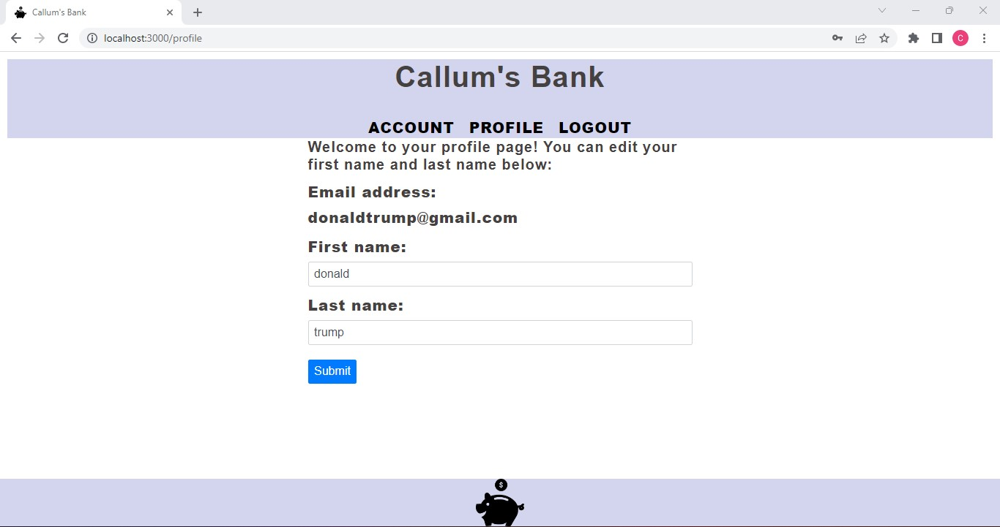
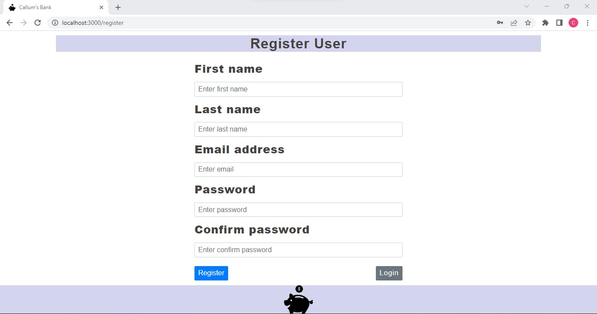
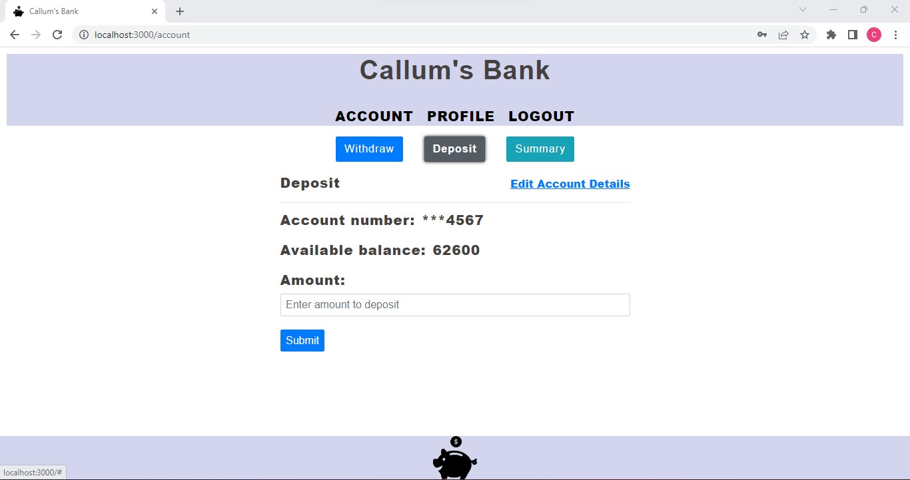

# Welcome Callum's Bank!

    
     
    
    
    
     
    
    
     
      

# Banking project:

- API with json web token authentification

- Full CRUD functionality

- Node.js API

- Backend relational database (postgreSQL)

- Frontend views (React/Redux)

Click [here](https://github.com/callumgordon90/Bank-API) to view the git repository

-------------------
# Part 1: BACKEND API AND DATABASE:

## Introduction:

- In this project I was tasked with creating a fully functioning REST API which connects to a backend relational database, and whose endpoints can be tested in Postman. For the database, I chose to use postgreSQL, and rest of the program is written in node.js with the express dependency. I used the yarn package manager in node to manage all dependencies  
  

--------------------------------------------

## Overview of backend API and database:

The API contains the following features:

- A user can register themselves on the database and create a profile

- They can then log in and log out of their profile (this functionality is controlled by JSON webtoken)

- Once inside their profile, the user can view their financial transacions
  
- The user can deposit money into their account or withdraw money

- The user can assess a summary of all of their financial transactions for a given date and download and print a pdf file of their account history (this functionality is controlled by the Puppeteer extension)

NOTE: The backend source code of this app is contained entirely in the 'server' folder:

***
A view of the database tables and how they relate to one another:

***

A view of all of the tables of the database as they appear in the code..

***

..and here we can see the user table as it appears in the PostgreSQL database

***

Run the command 'yarn start' in the server folder to start the server on port 5000...

***
...Now we can test the endpoints in Postman and check that the program is working correctly!

 

-------------------------------------------------

# Part 2 EXTRA!!!: FRONT END APP!

## Introduction:

- We can see that the backend functions correctly if we test the endpoints with Postman. However, I wanted to create a frontend so that users can interect directly with the backend. I created this frontend with React and Redux  
  

--------------------------------------------

## Characteristics of the frontend:

- The frontend has a component for each element the the user interacts with

- User data is guarded in Redux

- Once inside their profile, the user can view their financial transacions and download a PDF file to their local system
  

NOTE: The frontend source code of this app is contained entirely in the 'src' folder:

---------------------------------------
Home page of the app: the first thing that the user sees..

***
This is the profile page that the user sees after logging in:

***
The sign up page to create a profile:

***
This page gives the user an overview of all the possible transactions that they can undertake:

***

Here the user can deposit money into their account:
 
***
Here the user can withdraw money from their account

***

On this page the user can view a transaction report which contains all of their previous withdrawals and deposits for a given period:

***

..Finally, the user is able to donwload their transaction report in PDF format and print it off!

***

# Final Reflections on this project:

For me personally, as always, this was an interesting challenge and despite some difficulties and stresses that I had with this project, I learnt A LOT of new things even on this one project alone.

## Challenges and issues:

- controlling all versions of dependencies and making sure that they are all interacting with one another correctly

- configuring the server and the database correctly so that they can comminicate with one another

- testing the endpoints one by one in Postman and discovering issues with syntax in the code that prevented full functionality (a painstaking process)!

## New things that I learnt or improved my skills in:

- Learning to use PostgreSQL: PostgreSQL is an object-relational database, while MySQL is purely relational. It was intresting for me to learn to usePostgreSQL admin tool to interact with the API in this project

- Using the puppeteer dependency to convert html files into downloadable pdfs was interesting and is one of the elements that I am most happy with in this project

- Using yarn package manager. Up to this point I have been taught to use npm as the go-to package manager for node.js , so it was interesting and fun for me to create this project with an alternative

- Using React and Redux has always been a challenge for me (with the changing of states and using reducers being a challenge), so I feel this project increased my abilities on the frontend.

- Finally... I worked on two different development branches for this project ('main' and 'dev'). It wasn't necessary but I wanted to demonstrate my understanding of git and also simulate the kind of environment that would exist in a company with multiple people working on different branches of the same project.

---

Thanks for reading!

Callum Gordon
